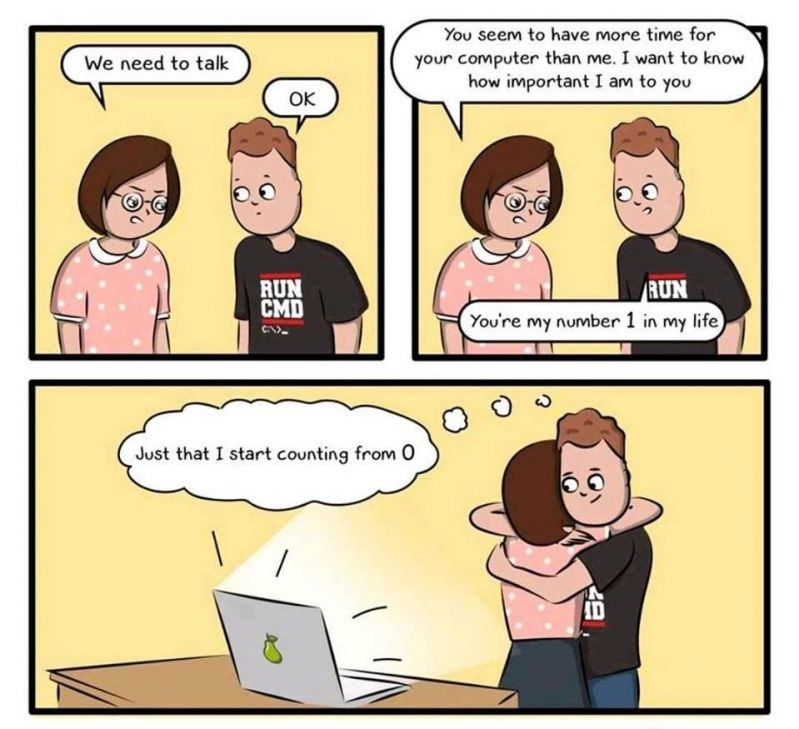

# 02.09.2022 report
Today we were programming with the help of lists. The exercices were easy except for the prime number exercice. I only didn't think long enough. 

The solution for the listen word riddle 2 exercice is:




### Prime number exercice
The problem was that with the code below, the number is divided by another number and the rest isn't an integer once then it's an prime number. That's false! 


```py
# !!! Code funktioniert nicht !!!

zahlen = []
primzahlen = []

for counter in range(2, 101):
    zahlen.append(counter)

for zahl in zahlen:
    for primzahl in primzahlen:
        if zahl % primzahl != 0:
            primzahlen.append(zahl)

print(primzahlen)
```


My solution was to create a boolean variable that is initiated as true. If the number divided by the prime number has no rest once, the bool is set to false. After the number was divided by all prime numbers the code checks if the bool is still true.

```py
zahlen = []
primzahlen = []
primzahl_bool = True

for counter in range(2, 101):
    zahlen.append(counter)


for zahl in zahlen:
    for primzahl in primzahlen:
        if zahl % primzahl == 0:
            primzahl_bool = False

    if primzahl_bool == True:
        primzahlen.append(zahl)
    primzahl_bool = True

print(primzahlen)

```