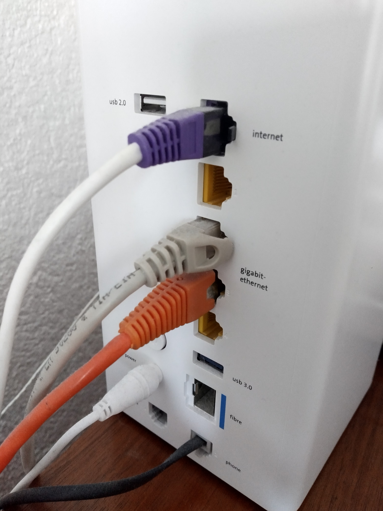
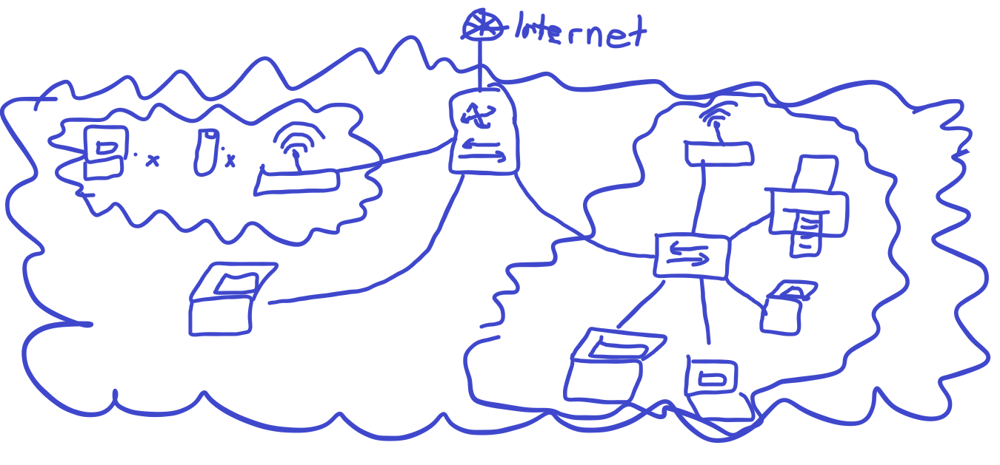

# Netzwerke zu Hause

Unser Router/Switch hat ein integriertes WLAN, mit welchem sich mehrere Handys und Computer verbinden. Zudem haben wir noch ein Ethernet-Kabel, welches mit einem weiteren Switch verbunden ist. Dieser Switch verbindet sich mit dem Drucker und ein paar Computern. Zudem kann man auch mit Ethernet-Kabeln direkt an den haupt Router/Switch verbinden. 

