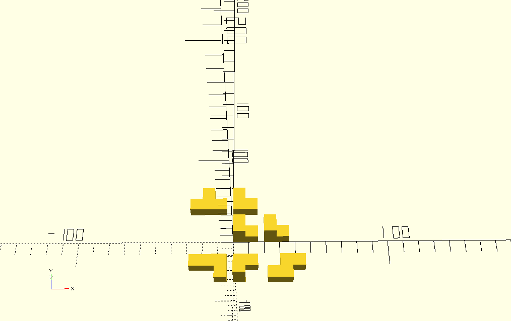

# Knobelwürfel


````scad
module wurf(){
cube([8, 8, 8]);
}

module kul(){
    union(){
    wurf();
    translate([8, 0, 0])
        wurf();
    translate([0, 8, 0])
        wurf();
    translate([0, 0, 8])
        wurf();
    }
}

kul();
translate([20, 0, 0])
    kul();

union(){
    translate([0, 20, 0])
        wurf();
    translate([8, 20, 0])
        wurf();
    translate([0, 28, 0])
        wurf();
}

union(){
    translate([0, -20, 0])
        wurf();
    translate([8, -20, 0])
        wurf();
    translate([0, -28, 0])
        wurf();
    translate([0, -28, 8])
        wurf();
}

union(){
    translate([30, -20, 0])
        wurf();
    translate([38, -20, 0])
        wurf();
    translate([30, -28, 0])
        wurf();
    translate([22, -28, 0])
        wurf();
}


union(){
    translate([-20, 20, 0])
        wurf();
    translate([-28, 20, 0])
        wurf();
    translate([-20, 28, 0])
        wurf();
    translate([-12, 20, 0])
        wurf();
}

union(){
    translate([-20, -20, 0])
        wurf();
    translate([-28, -20, 0])
        wurf();
    translate([-12, -28, 0])
        wurf();
    translate([-12, -20, 0])
        wurf();
}
````