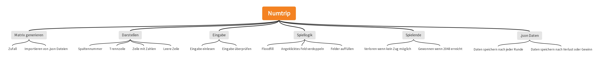

# Numtrip-Blog
## Das geniale Spiel
### Vom Meister

Das Ziel des Spieles ist es zu gewinnen. Man gewinnt, indem eine Zahl den Wert von 2048 erreicht. Man kann den Wert einer Zahl erhöhen, indem man ein Feld auswählt, welches als Nachbarsfeld, ein Feld mit einem gleichen Wert hat. 

## Umsetzung
### Voraussetzungen:
- Python 3
- Playsound Version 1.2.2

Auf dem Internet findet man viele Anleitungen, wie man Python installieren soll. Playsound jedoch nicht darum hier eine Anleitung:

```bat
pip install playsound==1.2.2
```

Der Output sollte dann folgender sein:
```bat
Collecting playsound==1.2.2
  Using cached playsound-1.2.2-py2.py3-none-any.whl (6.0 kB)
Installing collected packages: playsound
Successfully installed playsound-1.2.2
```
Wenn man dann schauen will, ob playsound wirklich heruntergeladen ist, kann man das so überprüfen:
```bat
Directory> pip freeze
altgraph==0.17.3
astroid==2.12.13
autopep8==2.0.1
colorama==0.4.6
dill==0.3.6
future==0.18.2
isort==5.11.4
lazy-object-proxy==1.8.0
mccabe==0.7.0
numpy==1.24.1
opencv-python==4.7.0.68
pefile==2022.5.30
platformdirs==2.6.2
playsound==1.2.2 <- Hier habe wir playsound
pycodestyle==2.10.0
pygame==2.1.3.dev8
pyinstaller==5.7.0
pyinstaller-hooks-contrib==2022.14
pywin32-ctypes==0.2.0
tomlkit==0.11.6
wrapt==1.14.1 
```
Wenn playsound in der oberen Liste vorkommt, wie im Beispiel, dann wurde playsound heruntergeladen. 

### Top-Down-Diagramm
<button> Hier ist ein Top-Down Entwurf</button>



### Algorithums
Für den Floodfill-Algorithmus bin ich folgenderweise vorgegangen. 
Zuerst muss man den Wert des ausgewählten Feldes in einer separaten Variabel speichern und dann den Wert löschen, damit später nicht das gleiche Feld rekursiv aufgerufen wird. 
```py
alter_wert = matrix[feld[0]][feld[1]]
matrix[feld[0]][feld[1]] = 0
```
Dann schaut man, ob ein Nachbarsfeld oben, unten, rechts oder links existiert. Für alle Richtungen, in welcher ein Feld existiert wird überprüft, ob der Wert des Nachbarfeldes der gleiche ist, wie der des ausgewählten. Wenn ja wird die Funktion rekursiv aufgeruft für das Feld, um zu überprüfen, ob noch mehr Felder mit dem gleichen Wert an das Nachbarsfeld grenzen. Hier ein Beispiel für eine Überprüfung rechts:
```py
if feld[0] < 4:
  if matrix[feld[0] + 1][feld[1]] == alter_wert:
    nachbarsfelder([feld[0] + 1, feld[1]])
```
Rekursiv: Eine Funktion A in der Funktion A aufrufen. 

## Herausforderung
Eine Herausforderung für mich war es, herauszufinden was ich in meinem Code noch kürzen kann, wie zum Beispiel Listen mit Hilfe von Generatoren zu erstellen, und dass der Code noch leserlich bleibt. 

## Tipps
Ich finde, dass man keinen Top-Down Entwurf sondern eher ein Flow Diagramm machen sollte. Ich finde, dass das bei der Programmerstellung mehr hilft. Sonst sollte man nicht im letzen Moment alles machen, sondern schon früh anfangen, denn Programmieren braucht viel Zeit und wenn man einem Punkt ist, wo man nicht mehr weiter weiss, hilft oft eine kleine Pause, ein kleiner Spaziergang oder so, und man hat eine Idee. 

## Link
Auf der github-Seite. 
<a href="https://github.com/GabrielMariethoz/EF-Informatik/blob/main/numtrip/game_v2.py">Reeeeeeeeeee</a>